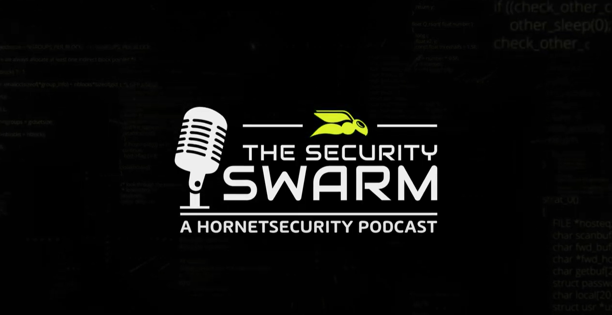

# Hello World

Welcome to my profile! If you're here, you're likely wondering who I am, or some of my content, somewhere out on the web, directed you here. Hello, and welcome!

I use this space to organize and centralize links to all of the resources, community work, public speaking and other stuff I work on out on the interwebz. If you're looking to get ahold of me, I am most active on [LinkedIn](https://www.linkedin.com/in/asyrewicze) these days!

Looking forward to hearing from you!

## Who is This Andy Guy?

### **Pronouns**

He / Him

### **About Andy**

Andy is a 20+ year IT Pro specializing in Infrastructure, the M365 Suite, Cybersecurity and Cloud Services such as Microsoft Azure. By day he works as a Security Evangelist for [Hornetsecurity](https://www.hornetsecurity.com), and by night he shares his IT knowledge online in IT communities or over a cold beer. Andy is an 10-time awardee of the [Microsoft MVP](https://mvp.microsoft.com/en-us/PublicProfile/5000844?fullName=Andy%20Syrewicze) award in the Cloud and Datacenter Management competency.

### **Fun Ice-Breaker Fact About Andy**

I'm a woefully addicted gamer. Currently playing Elden Ring, and Final Fantasy 7 Rebirth!

## What am I Currently Working on?

All of the below sources are platforms that I'm currently creating content for.

### **Content Creator and Security Evangelist for [Hornetsecurity](https://www.hornetsecurity.com)**

In my day job as a Security Evangelist (One part technical, one part marketing, one part pre-sales) I spend my time listening to the community, doing presentations, having technical conversations and creating content that will help system admins and security professionals be more efficient with their day-to-day tasks while also helping them keep their eye on the future of the industry.

Much of the Hornetsecurity content I contribute too can be found on the Hornetsecurity Youtube channel.

---

### **Host of the [Security Swarm Podcast](https://www.youtube.com/playlist?list=PLZDR2zpfWAzvGsR0qDMXiAiRoHcMogWhw)**

The Security Swarm Podcast is a podcast that focuses on topics in the cybersecurity space. While we look at a broad range of security topics, most episodes look at security through the lens of Microsoft 365. The show is available on the below platforms and hosts a wide array of different guests from a variety of backgrounds.

The show is posted weekly and is available on:

- [YouTube](https://www.youtube.com/playlist?list=PLZDR2zpfWAzvGsR0qDMXiAiRoHcMogWhw)
- [Spotify](https://open.spotify.com/show/4C2NbAbOlhgx0Fo3bkg712)
- [Apple Podcasts](https://podcasts.apple.com/us/podcast/the-security-swarm-a-hornetsecurity-podcast/id1605128233)
- [Amazon Podcasts](https://www.amazon.com/The-SysAdmin-DOJO-Podcast/dp/B09QK5GNWH)

---

### **Andy is [The InfoTech Gamer](https://www.twitch.tv/theinfotechgamer) on Twitch!**

While still a work in progress (with all that spare time I have!) - I had this crazy idea that IT Pros may, possibly, be a group of people that are inclined to enjoy video games (like me!). The InfoTech Gamer Twitch channel is a community that is designed to give IT Pros and tech enthusiasts a place to hang out after long hours in the trenches. I had initially created the channel primarily with gaming in mind, but I pumped the breaks when i realized I didn't want to add to the noise of all the other gaming channels that are already out there.

With that in mind, I stream occasionally at [The InfoTech Gamer](https://www.twitch.tv/theinfotechgamer)! Now with a combination of gaming streams, and 1-hour technical live learns (like shown below). I'd like to increase the cadence of streams in the future, once my schedule allows!

---

### **Author of the [Anxious Techie SubStack - Coming Soon!!](https://anxioustechy.substack.com)**

This is one of my newest ideas and is currently on the back-burner due to other initiatives! That said, I still feel it's important, and I'm hoping to get back to the concept sometime throughout 2024.

In 2021, I was diagnosed with Generalized Anxiety Disorder and (surprise!), turns out I had been suffering from it my entire life.

While my tech learning slowed down in 2020 and 2021 as a result, I started getting help and learned how to cope with my anxiety disorder and not be avoidant. While I hated the fact that my tech learning slowed down somewhat this last year and a half, I had the BIG realization that learning to deal with any mental illness is a skill. If I wanted to manage SQL, I'd go learn about SQL. Mental Illness is no different in this regard!

If you're interested in how all this played out through the lens of my career in tech, I actually had the pleasure of being on the [Nerd Journey Podcast](https://nerd-journey.com) and [we discussed anxiety specifically in this episode](https://nerd-journey.com/anxious-living-worry-and-hope-with-andy-syrewicze-3-3/).

That all said, just like I do with technical topics, I felt the need to try and share my story and personal learnings in the hopes of helping others that are dealing with anxiety or other mental health issues. The biggest thing is knowing that you're not alone. On top of that, the continued stigma against mental health in society SUCKS and needs to end. This is my way of shining light on that!

I hope you will [subscribe and join](https://anxioustechie.substack.com) the conversation regarding mental health in our community!

## Ask Me About Public Speaking

I enjoy speaking to crowds of all shapes and sizes both in-person and virtually. That includes small groups all the way up to keynote styled sessions with large crowds in the audience. I'm able to speak on the below topics:

- Cybersecurity
- PowerShell
- Windows Server Stack (Including Azure Stack HCI!)
- Hyper-V and Virtualization
- Microsoft Azure IaaS and PaaS
- Microsoft 365 Administration
- IT Career Coaching
- Anxiety and Coping Skills
- Presentation, Content Generation, and Streaming / Video Skills
- Technical Marketing Topics
- Community Creation and Support

NOTE: If you're conference uses Sessionize - [**Here is a link**](https://sessionize.com/andy-syrewicze/) to my Sessionize Profile!

**NOTE**: If you'd like me to come speak an any of the above topics, reach out to me via the "How to Get in Touch with Me" section below!

## What I'm Currently Learning

- All Things Cybersecurity!
- In-Depth M365 Security Hardening
- Use of Generative AI with a Focus on Co-Pilot
- Security for Generative AI
- Continuously Improving my Writing and Markdown Know-how
- Taekwondo
- Anxiety Management and Mental Well Being

## How to Get in Touch with Me

I'm generally available at most waking hours on both of the below platforms. For more detailed conversations, I'll happily provide different contact preferences if needed.

- [Mastadon](https://infosec.exchange/@andysandwich)
- [LinkedIn](https://www.linkedin.com/in/asyrewicze)

<!--
**asyrewicze/asyrewicze** is a ✨ _special_ ✨ repository because its `README.md` (this file) appears on your GitHub profile.

Here are some ideas to get you started:

- 🔭 I’m currently working on ...
- 🌱 I’m currently learning ...
- 👯 I’m looking to collaborate on ...
- 🤔 I’m looking for help with ...
- 💬 Ask me about ...
- 📫 How to reach me: ...
- 😄 Pronouns: ...
- ⚡ Fun fact: ...
-->
