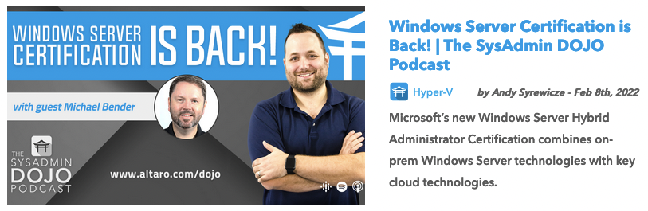

# Hi, Everyone!

Welcome to my profile! If you're here, you're likely wondering who I am, or some of my content, somewhere out on the web, directed you here. Hello, and welcome!

I use this space to organize and centralize links to all of the resources, community work, public speaking and other stuff I work on out on the interwebz. If you're looking to get ahold of me, I am active on [Twitter, and DMs are open to the public](https://www.twitter.com/asyrewicze)! I can also be contacted through [LinkedIn](https://www.linkedin.com/in/asyrewicze) if that platform is more of your jam!

Looking forward to hearing from you!

## Who is This Andy Guy?

### **Pronouns**

He / Him

### **About Andy**

Andy is a 20+ year IT Pro specializing in Infrastructure, the M365 Suite, and Cloud Services such as Microsoft Azure. By day he works as a Technical Evangelist for [Hornetsecurity](https://www.hornetsecurity.com), and by night he shares his IT knowledge online in IT communities or over a cold beer. Andy is an 8-time awardee of the [Microsoft MVP](https://mvp.microsoft.com/en-us/PublicProfile/5000844?fullName=Andy%20Syrewicze) award in the Cloud and Datacenter Management competency, and Andy is one of few who is also a [VMware vExpert](https://vexpert.vmware.com/directory/1607).

### **Fun Ice-Breaker Fact About Andy**

I'm a crazy poodle dad. You can bet money that if you see a video of me somewhere on the net, chances are, this dog is snoozing somewhere behind the camera.

## What am I Currently Working on?

All of the below sources are platforms that I'm currently creating content for.

### **Content Creator and Editor @ the [Altaro Software DOJO](https://www.altaro.com/dojo)**

In my day job as a Technical Evangelist I spend my time listening to the community, and creating technical content that will help system admins be more efficient with their day-to-day tasks while also helping them keep their eye on the future of the industry.

The webinar shown below is just one example of my contributions in this area.

[The Altaro Software DOJO](https://www.altaro.com/dojo) is a content platform for IT Pros looking for high-quality educational content focused on Hyper-V, VMware, Microsoft 365, Backup / DR, MSPs, and More!

---

### **Host of the [SysAdmin Dojo Podcast](https://www.altaro.com/dojo/sysadminpodcast/)**

One of my newer day-job projects, and one I'm SUPER excited about. We've talked about doing a podcast for our Dojo platform for a long time, and through a lot of work from a lot of different people, we were finally able to make it a reality! 

**NOTE**: The show is available on all major platforms with new episodes weekly!

[Listen to the SysAdmin Dojo Podcast Here](https://www.altaro.com/dojo/sysadminpodcast/)!

---

### **Andy is [The InfoTech Gamer](https://www.twitch.tv/theinfotechgamer) on Twitch!**

I had this crazy idea that IT Pros may, possibly, be a group of people that are inclined to enjoy video games (like me!). The InfoTech Gamer Twitch channel is a community that is designed to give IT Pros and tech enthusiasts a place to hang out after long hours in the trenches. I had initially created the channel primarily with gaming in mind, but I pumped the breaks when i realized I didn't want to add to the noise of all the other gaming channels that are already out there.

With that in mind, [The InfoTech Gamer](https://www.twitch.tv/theinfotechgamer) channel is back in 2022! Now with a combination of gaming streams, and 1-hour technical live learns (like shown below) that occur twice a week on Tues / Thurs.

#### Current Weekly Stream Schedule

**NOTE**: The finalized stream schedule is still somewhat fluid. For channel updates see [The InfoTech Gamer Twitter Account](https://www.twitter.com/infotechgamer) for the latest stream info!

##### Live Learn Streams

- Twice Weekly during US Eastern Timezone Lunch hours

**NOTE**: Currently I don't have defined days for these. I TRY to make Tuesday/Thursday work, but that doesn't always happen. As such, be on the lookout for these on any given weekday.

##### Gaming Streams

- Monday Game Stream - 5:00pm EST to 7:00pm EST
- Friday Game Stream - 9:00pm EST to 11:00pm EST

---

### **Author of the [Anxious Techy SubStack - Coming Soon!!](https://anxioustechy.substack.com)**

This is my newest project, and perhaps the one I'm most excited about! In 2021, I was diagnosed with Generalized Anxiety Disorder and (surprise!), turns out I had been suffering from it my entire life.

While my tech learning slowed down in 2020 and 2021 as a result, I started getting help and learned how to cope with my anxiety disorder and not be avoidant. While I hated the fact that my tech learning slowed down somewhat this last year and a half, I had the BIG realization that learning to deal with any mental illness is a skill. If I wanted to manage SQL, I'd go learn about SQL. Mental Illness is no different in this regard!

If you're interested in how all this played out through the lens of my career in tech, I actually had the pleasure of being on the [Nerd Journey Podcast](https://nerd-journey.com) and [we discussed anxiety specifically in this episode](https://nerd-journey.com/anxious-living-worry-and-hope-with-andy-syrewicze-3-3/).

That all said, just like I do with technical topics, I felt the need to try and share my story and personal learnings in the hopes of helping others that are dealing with anxiety or other mental health issues. The biggest thing is knowing that you're not alone. On top of that, the continued stigma against mental health in society SUCKS and needs to end. This is my way of shining light on that!

I hope you will [subscribe and join](https://anxioustechy.substack.com) the conversation regarding mental health in our community!

## Ask Me About Public Speaking!

I enjoy speaking to crowds of all shapes and sizes both in-person and virtually. That includes small groups all the way up to keynote styled sessions with large crowds in the audience. I'm able to speak on the below topics:

- General IT Infrastructure
- Windows Server Stack
- Hyper-V and Virtualization
- Microsoft Azure IaaS and PaaS
- Microsoft 365 Administration
- IT Career Coaching
- Anxiety and Coping Skills
- Presentation, Content Generation, and Streaming / Video Skills
- Technical Marketing Topics
- Community Creation and Support

**NOTE**: If you'd like me to come speak an any of the above topics, reach out to me via the "How to Get in Touch with Me" section below!

## What I'm Currently Learning

- Azure Kubernetes Service
- In-Depth M365 Security Hardening
- The German Language
- Continuously Improving my Writing and Markdown Know-how
- Anxiety Management and Mental Well Being

## How to Get in Touch with Me

I'm generally available at most waking hours on both of the below platforms. For more detailed conversations, I'll happily provide different contact preferences if needed.

- [Twitter DMs](https://www.twitter.com/asyrewicze)
- [LinkedIn](https://www.linkedin.com/in/asyrewicze)

<!--
**asyrewicze/asyrewicze** is a ✨ _special_ ✨ repository because its `README.md` (this file) appears on your GitHub profile.

Here are some ideas to get you started:

- 🔭 I’m currently working on ...
- 🌱 I’m currently learning ...
- 👯 I’m looking to collaborate on ...
- 🤔 I’m looking for help with ...
- 💬 Ask me about ...
- 📫 How to reach me: ...
- 😄 Pronouns: ...
- ⚡ Fun fact: ...
-->
